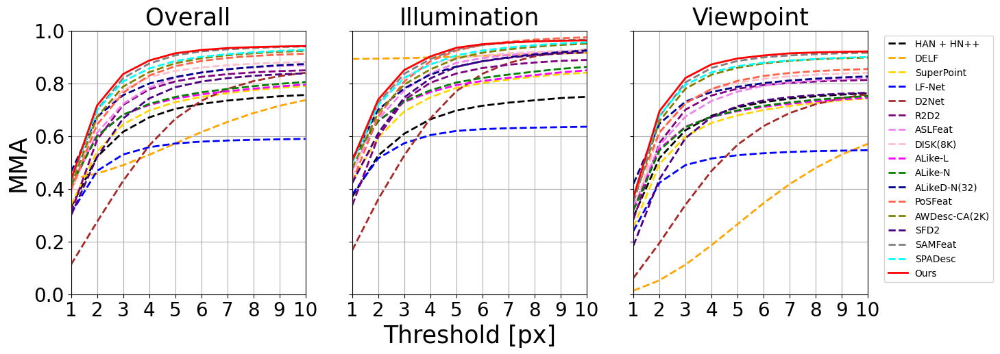

<!--
 * @Author: Yang Yi
 * @Date: 2026-03-18 10:10:30
 * @LastEditors: yiyang@nudt.edu.cn
 * @Description: 
 * 
 * Yang Yi
-->

<h1 align="center">GESS: Multi-cue Guided Local Feature Learning via Geometric and Semantic Synergy</h1>

<h3 align="center">
    <a href="">Yang Yi</a>, 
    <a href="">Xieyuanli Chen</a>, 
    <a href="">Jinpu Zhang</a>*, 
    <a href="">Hui Shen</a>*, 
    <a href="">Dewen Hu</a>
</h3>

    <a href="">Project Website (Coming Soon)</a>

    
    
    
    

# Benchmarking Results

### 1. HPatches Image Matching Benchmark

  

### 2. Visual Localization Benchmark
#### aachen-v1.0

  

#### aachen-v1.1

  

### 3. Relative pose estimation
For detailed experimental results, please refer to:
- 📊 [Detailed Results](./Results/Pose_Evaluation.txt)

### 4. 3D Reconstruction
For detailed experimental results, please refer to:
- 📊 [Detailed Results](./Results/3D_Reconstruction.txt)

